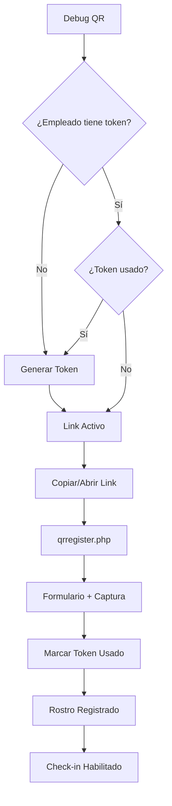

# 🐛 Debug QR - Modo de Desarrollo

## 📋 Descripción

Página de debug para probar links de registro biométrico y check-in sin necesidad de escanear QR codes con el celular.

## 🚀 Cómo Usar

### 1. **Acceder a la página**
```
http://localhost/web/debug-qr.php
```

### 2. **Funcionalidades**

#### 📊 **Dashboard**
- Estadísticas totales de empleados
- Contador de registrados y pendientes
- Buscador en tiempo real

#### 👤 **Por cada empleado**

**Link de Registro:**
- ✅ Ver el link completo generado
- 📋 Copiar link con un click
- 🌐 Abrir link directamente en el navegador
- 🔄 Generar nuevo token si el anterior fue usado
- ⚠️ Ver estado del token (activo/usado)

**Link de Check-in:**
- ✅ Link siempre disponible
- 📋 Copiar link con un click
- 🌐 Abrir link directamente en el navegador
- ℹ️ Indicador si requiere registro previo

### 3. **Flujo de Prueba**

#### **Probar Registro:**
```
1. Busca un empleado pendiente
2. Si no tiene token, genera uno con el botón "Generar Token"
3. Copia el link o ábrelo directamente
4. Completa el formulario de registro
5. Captura la foto facial
6. Confirma y guarda
7. El token se marca automáticamente como usado
```

#### **Probar Check-in:**
```
1. Busca un empleado YA REGISTRADO
2. Copia o abre el link de check-in
3. El sistema detectará automáticamente el rostro
4. Marca entrada/salida según corresponda
```

## 🎨 Características

### **Diseño Moderno**
- 🎨 Interfaz dark theme profesional
- 📱 Totalmente responsive
- ✨ Animaciones suaves
- 🎯 Cards organizadas por empleado

### **Funcionalidades**
- 🔍 Búsqueda instantánea por nombre, RUT o cargo
- 📊 Estadísticas en tiempo real
- 📋 Copia con un solo click
- 🌐 Apertura directa en nueva pestaña
- 🔄 Generación de tokens desde la misma página
- ⚡ Notificaciones toast al copiar

### **Estados Visuales**
- ✅ **Verde**: Empleado registrado
- ⏳ **Naranja**: Pendiente de registro
- 🟢 **Token activo**: Listo para usar
- 🔴 **Token usado**: Requiere nuevo token

## ⚙️ Configuración

### **Cambiar URL Base**
Edita la línea 17 en `debug-qr.php`:

```php
// Para desarrollo local
$baseUrl = 'http://localhost/web';

// Para servidor de pruebas
$baseUrl = 'http://192.168.1.100/web';

// Para producción
$baseUrl = 'https://fagotto.cl';
```

## 🔒 Seguridad

### ⚠️ **IMPORTANTE**

Esta página es **SOLO PARA DESARROLLO**. Debe ser eliminada o protegida en producción.

### **Protección Recomendada:**

#### Opción 1: Eliminar en producción
```bash
rm web/debug-qr.php
```

#### Opción 2: Proteger con contraseña
```php
// Agregar al inicio de debug-qr.php
session_start();
if (!isset($_SESSION['is_admin']) || $_SESSION['is_admin'] !== true) {
    die('Acceso denegado');
}
```

#### Opción 3: Restringir por IP
```php
// Agregar al inicio de debug-qr.php
$allowed_ips = ['127.0.0.1', '::1', '192.168.1.100'];
if (!in_array($_SERVER['REMOTE_ADDR'], $allowed_ips)) {
    die('Acceso denegado');
}
```

## 📸 Screenshots

### Dashboard
```
┌─────────────────────────────────────┐
│ 🐛 Debug Mode - Generador QR       │
│ ⚠️  SOLO PARA DESARROLLO            │
├─────────────────────────────────────┤
│ Total: 50  Registrados: 30  P: 20  │
├─────────────────────────────────────┤
│ 🔍 Buscar empleado...               │
└─────────────────────────────────────┘
```

### Card de Empleado
```
┌──────────────────────────────────────┐
│ JM  Juan Martínez        ✓ Registrado│
│     12.345.678-9 • Cajero            │
├──────────────────────────────────────┤
│ 📝 Link Registro    | ⏰ Link Check-in│
│ [link...]  📋       | [link...]  📋  │
│ [Abrir Link]        | [Abrir Link]   │
│ ✅ Token activo     | ℹ️  Listo      │
└──────────────────────────────────────┘
```

## 🛠️ Troubleshooting

### **Error: "Token no encontrado"**
- Genera un nuevo token desde el botón "Generar Token"
- Verifica que la tabla `registro_tokens` exista en la BD

### **Error: "Empleado no encontrado"**
- Verifica que el empleado exista en la tabla `employees`
- Actualiza la página para recargar los datos

### **Link no funciona**
- Verifica que `$baseUrl` esté correctamente configurado
- Asegúrate de que el servidor esté corriendo
- Revisa que los archivos `qrregister.php` y `qrcheck.php` existan

### **No se copian los links**
- El navegador debe tener permisos de clipboard
- Funciona en HTTPS o localhost
- Prueba manualmente seleccionando y copiando

## 📝 Notas

- ✅ Links de check-in siempre están disponibles
- ✅ Links de registro requieren token activo
- ✅ Tokens usados deben regenerarse
- ✅ Empleados sin registro no pueden hacer check-in
- ✅ La búsqueda filtra en tiempo real

## 🔄 Flujo Completo



## 🎯 Tips de Uso

1. **Búsqueda rápida**: Escribe cualquier parte del nombre
2. **Copia múltiple**: Abre varios links en pestañas
3. **Regenerar tokens**: Útil para pruebas repetidas
4. **Check estado**: Verde = listo, Naranja = pendiente
5. **Mobile testing**: Abre links en tu celular desde la misma red

---

**Creado**: 26 de Diciembre, 2025  
**Versión**: 1.0.0  
**Autor**: Debug Tools Team  
**Proyecto**: Fagotto ERP - Sistema Biométrico
